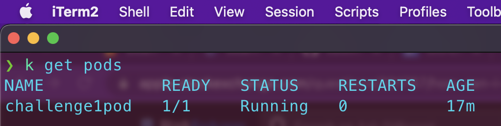
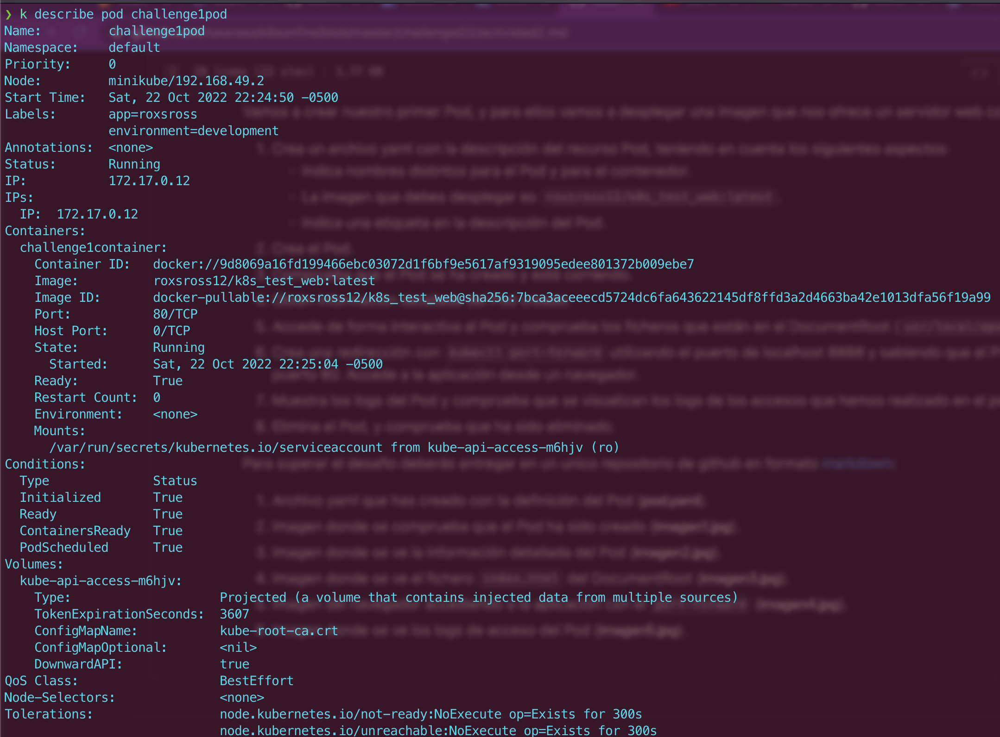
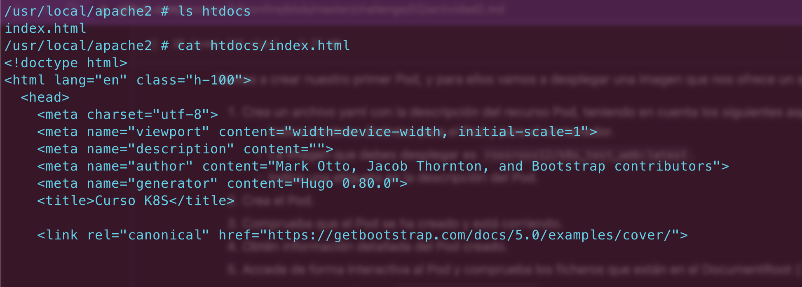
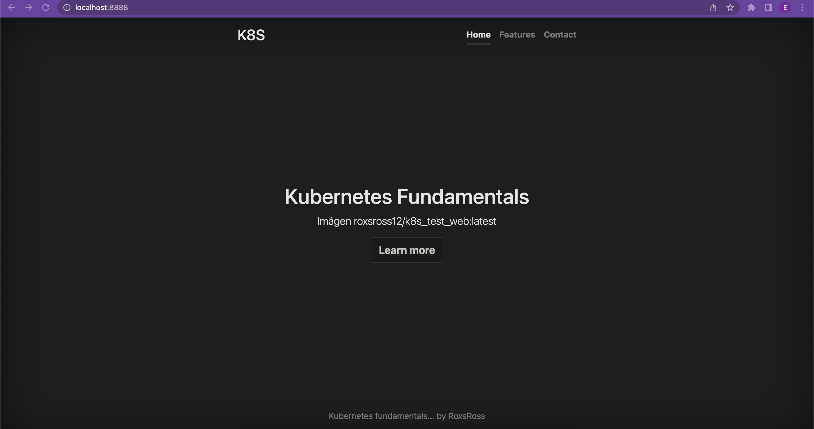
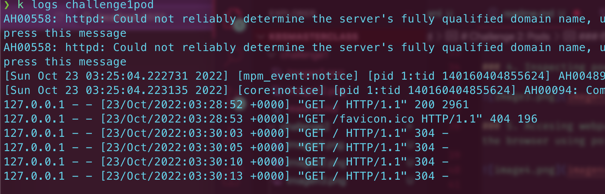

# Challenge 2: Pods 
---

### 1. Pod definition
[code](pod.yaml)

```
apiVersion: v1

kind: Pod

metadata:
  name: challenge1pod
  labels:
    environment: development
    app: roxsross

spec:
  containers:
  - name: challenge1container
    image: roxsross12/k8s_test_web:latest
    ports:
    - containerPort: 80
```

### 2. Pod creation



### 3. Pod description



### 4. Inspecting pod contents



### 5. Accesing webpage through the browser using port-forwarding



### 6. Checking logs from the pod


