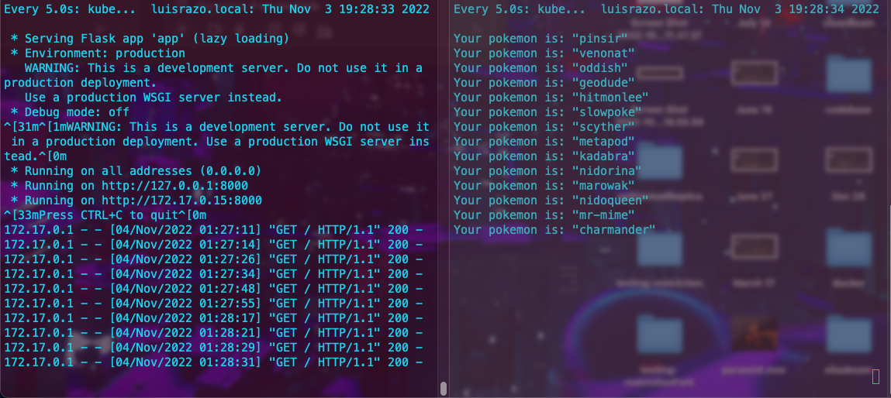

# On Fire Challenge :fire:

## Challenge Goals

* Implement the infrastructure described on the diagram provided in the [Final Challenge](https://github.com/roxsross/k8sonfire/blob/master/challenge-final/challenge.md).
* Have a Flask deployment serving an API which is meant to be consumed by other pods inside the cluster and also external users.
* The way to expose the API should be a Nodeport service.
* Build custom docker images for both consumer and app.

## Screen Shoot :camera:

